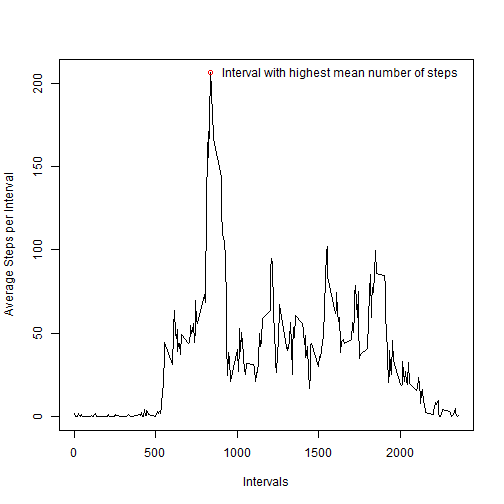

This is an R Markdown document, the first assignment for Reproducible Research.  The data used used for this work is found at the URL below: 

data source:  https://d396qusza40orc.cloudfront.net/repdata%2Fdata%2Factivity.zip

##Getting started:

As a first step, the required packages are pulled into the library (data.table and dplyr), the directory is defined.

```r
  library(data.table)
  library(dplyr)
  setwd("~/GitHub/CourseraDST/RepData_PeerAssessment1")
  url1 <-"activity.csv"
```


##Loading and preprocessing the data:

The data was imported into a dataframe from CSV file.  The character date converted to POSIXct for easier manipulation.

The date is converted to day names and added to a new variable "wkdy".  This variable is then updated to factor weekends or weekdays/workweek.  I used character substitution, if you see this it means I had not got a more elegant way to work before the deadline!

The next step was to split the dataframe into observations with and without "NA" for step values.


```r
  mydata1 <- read.csv(url1,header=TRUE, skip=0, na.strings="NA", stringsAsFactors=FALSE,nrows=-1L)

  mydata2 <- tbl_df(mydata1)
  mydata2$date <- as.POSIXct(mydata2$date, format = "%Y-%m-%d", tz="")
  mydata2$wkdy <- weekdays(mydata2$date, abbreviate = TRUE)
  mydata2$wkdy <- sub("Sun", "Weekend",mydata2$wkdy)
  mydata2$wkdy <- sub("Sat", "Weekend",mydata2$wkdy)
  mydata2$wkdy <- sub("Mon", "Weekday",mydata2$wkdy) 
  mydata2$wkdy <- sub("Tue", "Weekday",mydata2$wkdy)
  mydata2$wkdy <- sub("Wed", "Weekday",mydata2$wkdy)
  mydata2$wkdy <- sub("Thu", "Weekday",mydata2$wkdy)
  mydata2$wkdy <- sub("Fri", "Weekday",mydata2$wkdy)


  x <- subset(mydata2,is.na(mydata2$steps))

  ##count the number of NA values 
  stepNA <- nrow(x)

  cat(stepNA, " observations are NA values for step count")
```

```
## 2304  observations are NA values for step count
```

```r
  mydata3 <- subset(mydata2,!is.na(mydata2$steps))
```
##What is mean total number of steps taken per day?:

Sum the steps by date and calculate the mean and median. 

Note: In this set of results, only the populated observations are included in plots and calcs.


```r
##use data with only populated step data and group by date
DFGroupDate <- group_by(mydata3, date)
##calculate the total for each date
DFResultDate <- summarise(DFGroupDate,Mean = mean(steps), SUM = as.numeric(sum(steps)))

##calculate the mean and median of daily steps totals across the time periods
  stepMedian <-median(DFResultDate$SUM) 
  stepMean <-mean(DFResultDate$SUM) 
```


Figure 1. Histogram of total steps per day, with the calculated means and medians below


```r
 hist(DFResultDate$SUM, xlab = "Number of Steps per Day", ylab = "Frequency", col = "red", main = "Histogram of Daily Step Total")
```

 

```r
  cat("The mean daily total = ", round(stepMean))
```

```
## The mean daily total =  10766
```

```r
  cat("The median daily total = ", round(stepMedian))
```

```
## The median daily total =  10765
```

##What is the average daily activity pattern?

Group the step observations by intervals and calculate the means


```r
##use data with only populated step data and group by interval

  DFGroupInt<- group_by(mydata3, interval)

##calculate the average for each interval

  DFResultInt <- summarise(DFGroupInt,Mean = mean(steps), SUM = as.numeric(sum(steps)), MAX = as.numeric(max(steps)))

##identify the interval with the highest mean 
  stepMax <- max(DFResultInt$Mean)
  stepPoint <- subset(DFResultInt, Mean == stepMax)
```


Figure 2. The line graph of average steps per interval 

```r
  par(mar = rep(2, 4))
  plot(x=DFResultInt$interval, y=DFResultInt$Mean, type = "l", xlab = "Intervals", ylab = "Average Steps per Interval")
    points(x=stepPoint$interval, y=stepPoint$Mean, col = "red", type ="p")
    text(x=stepPoint$interval + 800, y=stepPoint$Mean,"Interval with highest mean number of steps")
```

 


Note: Intervals translate to 5 minute increments using the 24:00 clock, eg, 835 = 08:35, 1000 = 10:00, 2350 = 23:50


```
## Interval number  835  had the highest mean of  206
```

##Imputing missing values:

As the next step, the interval averages for observations with valid step data are used to populate the observations without data. The data set is re-combined and then the analysis is repeated. 


```r
  mydataNA <- subset(mydata2,is.na(mydata2$steps))
  mydataNA <- select(mydataNA, -steps)
  
  DFStepFill <- select(DFResultInt,-SUM,-MAX)
  colnames(DFStepFill)[2] <- "steps"
  
  mydataNAFill <- left_join(mydataNA,DFStepFill)
```

```
## Joining by: "interval"
```

```r
  DFStepsComp <- rbind(mydata3,mydataNAFill)
  
  DFGroupDateComp <- group_by(DFStepsComp, date)
  DFResultDateComp <- summarise(DFGroupDateComp,Mean = mean(steps), SUM = as.numeric(sum(steps)))

  stepMeanComp <-mean(DFResultDateComp$SUM)
  stepMedianComp <-median(DFResultDateComp$SUM)
```


Figure 3. Histogram of total steps per day, with NA values imputed

```r
  hist(DFResultDateComp$SUM, xlab = "Number of Steps per Day", ylab = "Frequency", col = "red", main = "Histogram of Daily Step Total (completed data)")
```

 

```r
  cat("Updated results after imputing missing data:")
```

```
## Updated results after imputing missing data:
```

```r
  cat("  The mean daily average = ", round(stepMeanComp))
```

```
##   The mean daily average =  10766
```

```r
  cat("  The median daily average = ", round(stepMedianComp))
```

```
##   The median daily average =  10766
```

```r
  cat("  ")
```

  

```r
  cat("The difference from prior calcualtions:")
```

```
## The difference from prior calcualtions:
```

```r
  cat("  The new mean - prior mean =", stepMeanComp -stepMean)
```

```
##   The new mean - prior mean = 0
```

```r
  cat("  The new median - prior median =", stepMedianComp -stepMedian)
```

```
##   The new median - prior median = 1.188679
```

##Are there differences in activity patterns between weekdays and weekends?:

Next the filled in data set is grouped by weekday vs weekend and interval to produce a panel plot comparing the interval averages for weekend vs weekday.  


```r
  DFGroupIntW<- group_by(DFStepsComp, interval, wkdy)

  DFResultIntW <- summarise(DFGroupIntW,Mean = mean(steps), SUM = as.numeric(sum(steps)), MAX = as.numeric(max(steps)))

library(lattice)
```


Figure 4. Mean Steps Weekend vs Weekday Intervals

```r
xyplot( Mean ~ interval | wkdy, type = 'b', panel = function(x, y) { llines(x=x,y=y) }, data = DFResultIntW, main = "Steps by Interval Weekend vs Weekday", xlab = "Intervals", ylab = "Mean Steps per Interval", layout=(c(1,2)))
```

 

Note: Intervals translate to 5 minute increments using the 24:00 clock, eg, 835 = 08:35, 1000 = 10:00, 2350 = 23:50

The data set was filled in using interval means; a future enhancement would be to fill in missing data using interval means plus weekday factor.
